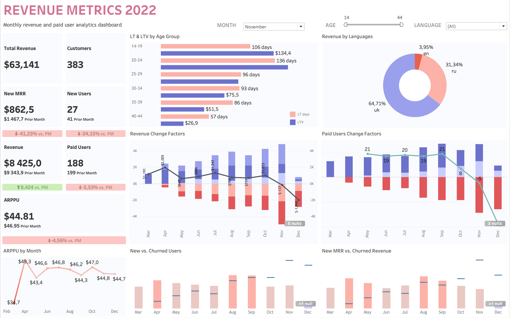

# Revenue Metrics Dashboard (2022)

Interactive Tableau dashboard for analyzing monthly recurring revenue, paid user dynamics, and key drivers of change.

**Live Dashboard:** [View on Tableau Public](https://public.tableau.com/app/profile/anastasiia.orlova3661/viz/RevenueMetrics_17897448117510/Dashboard1)

---

## Project Description

This dashboard was created as part of a data analytics project to help product managers track revenue performance and understand the main factors behind month-over-month changes.

The dashboard answers key business questions:
- How is revenue and the number of paid users changing over time?
- What are the main drivers of revenue change (New MRR, Expansion, Churn, Contraction)?
- How do Customer Lifetime (LT) and Lifetime Value (LTV) differ across age groups?
- What is the revenue distribution by user language?
- How is ARPPU trending throughout the year?

---

## Key Metrics Included

- Monthly Recurring Revenue (MRR)
- Paid Users
- Average Revenue Per Paid User (ARPPU)
- New Paid Users & New MRR
- Churned Users & Churned Revenue
- Expansion MRR & Contraction MRR
- Customer Lifetime (LT)
- Customer Lifetime Value (LTV)
- Month-over-Month changes for main KPIs

---
## SQL Query

The data for this dashboard was extracted from a PostgreSQL database using the SQL query available in this repository:

- [revenue_metrics_query.sql](revenue_metrics_query.sql)

---

## Dashboard Features

- **KPI Cards** with prior month comparison and % change indicators
- **Revenue Change Factors** – breakdown of positive and negative revenue movements
- **Paid Users Change Factors** – New, Reactivated, and Churned users with Net Change line
- **LT & LTV by Age Group** – dual bar chart
- **Revenue by Language** – donut chart
- **ARPPU Trend** by month
- **New vs Churned Users** and **New MRR vs Churned Revenue** comparison charts
- Interactive filters: **Month**, **Age**, **Language**

---

## Tools & Skills Demonstrated

- SQL
- Tableau Desktop / Tableau Public
- Advanced calculated fields (Net Change, negative churn measures, age grouping, MoM calculations)
- Dual-axis charts and combination charts
- Dashboard design principles (visual hierarchy, 5-second rule, consistent color scheme, clear labeling)
- Data storytelling for product and revenue teams

---

## How to Use

1. Open the live version on Tableau Public (recommended)
2. Or download the `Revenue_Metrics.twbx` file from this repository and open it in Tableau Desktop or Tableau Public

---

## Project Requirements Covered

- At least 10 key SaaS metrics
- Filters by date, user language, and age
- Minimum 5 visualizations
- Two dedicated charts showing month-over-month change factors for Revenue and Paid Users
- Clean visual design following dashboard best practices

---

## Author

**Anastasiia Orlova**  
Aspiring Data Analyst  

- [LinkedIn](www.linkedin.com/in/anastasiia-orlova-w)  
- [Tableau Public](https://public.tableau.com/app/profile/anastasiia.orlova3661)
